# Do Or Dice!

Do Or Dice! is a Javascript application built to allow users to roll multiple die to aid when playing role playing games. It was built in consideration for players of Dungeons and Dragons but can be adapted for other games.

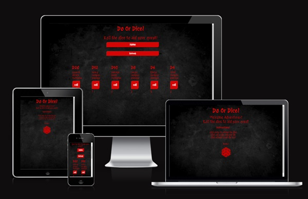

[Do or Dice! link](https://mcamish29.github.io/do_or_dice/)

## Features

### Site Wide

- Favicon
  - An on theme favicon will appear across all pages to allow the user to easily identify the page tabs.

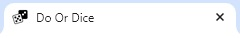

### Landing page

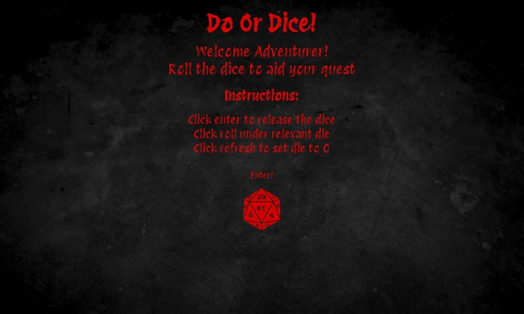

- Welcome message
  - The landing pages displays a welcome message to the users keeping in theme with the fantasy aspect of the website.

- Instructions
  - The user will be presented with instructions on how to utilize the website.

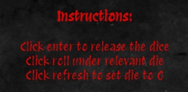

- Enter link
  - Clicking on the enter link it will move the user to the dice.html page where the user can begin using the website functions.

- Dice image
  - An on theme image will be displayed to the user.

### Dice page

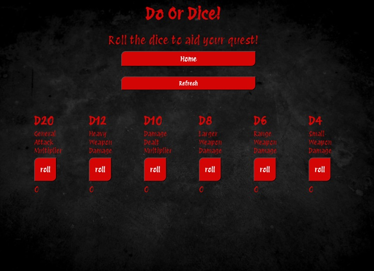

* Home button
    * A button will be located on the dice page which will be able to return the user to the landing page.

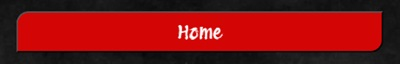

* Refresh button
    * A button will be located on the dice page which will be able to refresh the die results for the next roll.

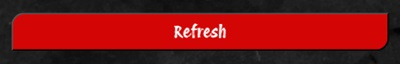

* Dice options
    * There are 6 dice options all with specific criteria to aid in the role playing game for the users.
    * Clicking on the roll button will display results from 1 to the highest value of the die, *i.e D20 = 1 to 20.*
    * The result of the dice roll will appear underneath the roll button.

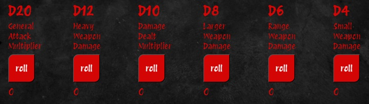

### Features left to implement
* A table to log the previous results 
* Custom die criteria for the user to adapt to other role playing games.

## Technologies
* HTML
    * The structure of the website was developed using HTML as the main language.
* CSS
    * The website was styled using an external CSS file.
* Javascript
    * The logic of the website was created using an external Javascript file.
* Visual Studio Code
    * The website was developed using Visual Studio Code IDE.
* GitHub
    * Source code is hosted on GitHub and deployed using Git pages.
* Git/ GitHub Desktop
    * Used to push code during development
* Tinyjpg
    * https://tinyjpg.com/ was used to reduce image sizes across website
* Flaticon.com
    * https://www.flaticon.com/ was used to obtain favicon
*  Convertio.co
    * https://convertio.co/ was used to convert jpg & png images into webp
 * Pixabay
    * https://pixabay.com/  was used to obtain free stock images

## Testing

### Responsiveness

All web pages were tested to show responsiveness from 280px upwards.

**Steps taken to test responsiveness:**

1. Open browser
2. Navigate to [Do Or Dice!](https://mcamish29.github.io/do_or_dice/)
3. Open developer tools by right clicking and selecting inspect
4. At the top of the page reduce dimensions to 280px x 858px 
5. click and drag the responsive window to maximum width

**Expected:** 

Fully responsive website across all pages with no images or content being stretched or warped
No horizontal scroll present
Elements no overlapping creating a bad user experience

**Actual**

The behavior of the website was as expected with the exception of instruction elements not responding with full screen size adjustment.

### Devices

The website was also tested on below devices to ensure no responsive issues

- Samsung Galaxy s22 Ultra
- Apple iPad pro

### Accessibility

[Wave Accessibility](https://wave.webaim.org/) was used during development and final stages of testing to check for any accessibility issues.

* Issue:
    * Background color was creating a contrast error with the font color.

* Fix:
    * Background color adjusted to produce a better result on Wave Accessibility.

### Lighthouse Testing

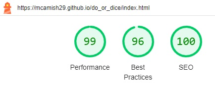
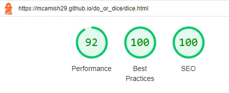

### Functional Testing
Through out development, testing was carried out to ensure that links to navigate between pages and all Javascript worked. 

**Enter Link**

| Navigation Link | Page to Load |
| --------------- | ------------ |
| Enter!          | dice.html   |

---

**Home Link**
| Navigation Link | Page to Load |
| --------------- | ------------ |
| Home            | index.html   |

---

**Refresh Button**
| Script | Action |
| --------------- | ------------ |
| Refresh            | Resets die results to 0   |

### Validator Testing

- HTML
    - No errors were returned when passing through the official [W3C validator](https://validator.w3.org)

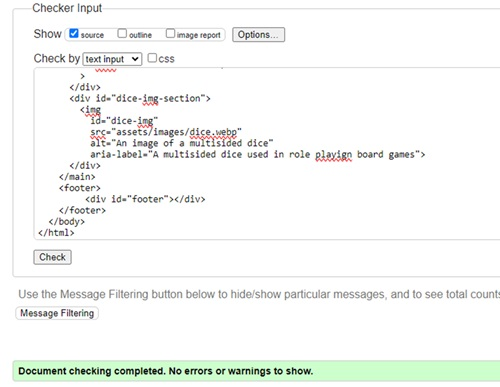

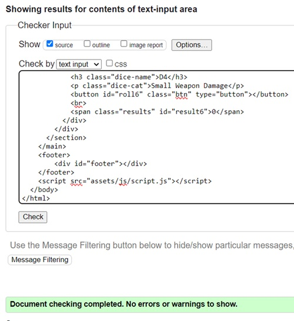

- CSS
    - No errors were returned when passing through the official [(Jigsaw) validator](https://jigsaw.w3.org)  

- Javascript
    - No errors were returned when passing through [JShint validator](https://jshint.com/)  

## Deployment

### Version Control

The website was created and committed using Visual Studio Code, to be then pushed by GitHub desktop to the remote repository 'do_or_dice'

The following git commands were used throughout development to push code to the remote repo:

- git add <*file*>
- git commit -m "commit message"
- git push

### Deployment to GitHub Pages

The site was deployed to GitHub pages. 
- The steps to deploy are as follows: 
  - On the repository for 'do_or_dice' select settings ont he navigation options along the top
  - Select 'Pages' on the left hand side
  - Select 'Main' as the source branch
  - Click the save button
  - A newly created link to the website will be created

A link to the deployed page can be found [here](https://mcamish29.github.io/do_or_dice/)

### Clone the Repository Code Locally

Navigate to the GitHub Repository you want to clone to use locally on IDE:

* Click on the code drop down button
* Click on HTTPS
* Copy the repository link to the clipboard
* Open your IDE of choice (ensure you have git installed as it is require for next step)
* Type git clone copied-git-url into the IDE terminal

The repository has now been cloned onto local IDE for use.

## Credits

### Javascript

* Return to home page Javascript code was obtained from [here](https://stackoverflow.com/questions/7077770/window-location-href-and-window-open-methods-in-javascript )

### Media

* Media was taken from freestock website [Pixabay](https://pixabay.com/)